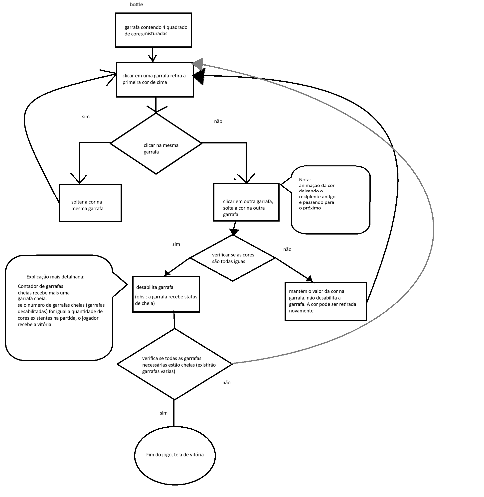
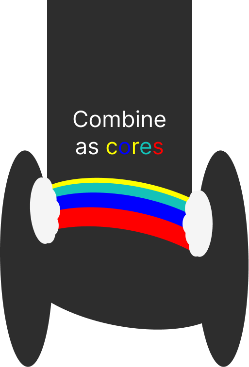
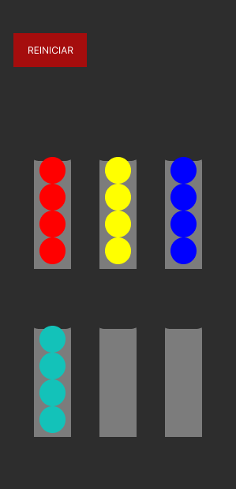
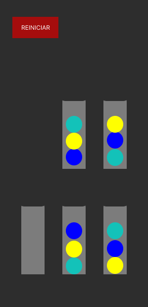
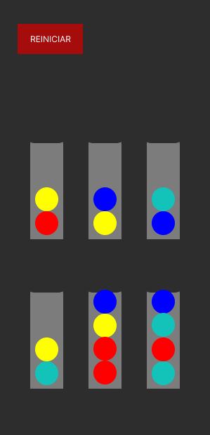
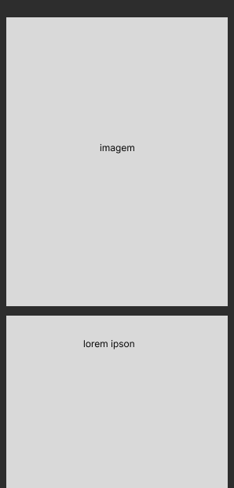

<h1>Project Mother's Day(PMD)</h1>

A ideia desse projeto é esconder uma mensagem surpresa de dia das mães quando o jogo for vencido. Foi um projeto criado para entregar a minha mãe no dia 10 de maio de 2026.

Este é um jogo curto de 2 fases sobre combinar cores em um só frasco para vencer o jogo e ir para a próxima fase.  
Este jogo foi pensado para ser jogado apenas em celulares. Executar a página principal no computador não quebra o código mas a interface fica presa no canto esquerdo da tela.  
A interatividade do site foi feito em JavaScript, a interface foi feita com HTML/CSS.

<h2>Veja o projeto funcionando por este link:</h1>
https://emilli-giuliane.github.io/PMD/

<h1>Descrição mais detalhada do projeto</h1>

Um jogo de combinação de cores. 
O objetivo do jogo é combinar cores dentro das garrafas de vidro. O jogo termina depois que todas as garrafas estiverem preenchidas com as cores corretas. Quando o jogador vencer ele receberá uma mensagem de vitória.

<h2>Requisitos</h2>
<table>
    <caption>Requisitos funcionais</caption>
    <thead>
        <tr>
            <th>RF 1</th>
            <th>RF 2</th>
            <th>RF 3</th>
        </tr>
    </thead>
    <tbody>
        <tr>
            <td>O número de garrafas deve ser maior que o número de cores para facilitar ao realocar as cores nas garrafas. Ou seja, ao final do jogo, uma garrafa ou duas ficará obrigatoriamente vazia.</td>
            <td>A página da tela de vitória deve ser um link direcionado. Esse detalhe importa pois ao carregar a página, o css é sempre carregado após o html, sendo assim esconder o conteúdo não será suficiente para esconder o segredo da tela de vitória. Se ela for revelada antes do objetivo do jogo ser concluído, o projeto fracassa.</td>
            <td>O jogo deve ser propositalmente fácil para que seja vencido. O objetivo é que o usuário chegue a tela de vitória, e não cansar o usuário, permitindo ele de chegar a tela de vitória.</td>
        </tr>
    </tbody>
</table>

<table>
    <caption>Requisitos não funcionais</caption>
    <thead>
        <tr>
            <th>RNF 1</th>
            <th>RNF 2</th>
            <th>RNF 3</th>
            <th>RNF 4</th>
        </tr>
    </thead>
    <tbody>
        <tr>
            <td>Feito em JavaScript, CSS e HTML.</td>
            <td>Deverá rodar em celulares primariamente, responsivamente.</td>
            <td>Desenhos dos elementos feitos vetorialmente (.svg) via CSS.</td>
            <td>Paleta de cores: 
                <i>bolas:</i> 
                azul: 0000FF; 
                azul-claro: 13C2B9; 
                vermelha: FF0000; 
                amarelo: FFFF00; 
                fundo: 2D2D2D; 
                frasco: 7C7C7C; 
                branco: D9D9D9; 
            </td>
        </tr>
    </tbody>
</table>

<h2>Workflow (Kanban)</h2>
<h3>Telas</h3>
<label><input type="checkbox" disabled checked>✅Criar html primeira tela</label> 
<label><input type="checkbox" disabled checked>✅ Criar css primeira tela</label> 
<label><input type="checkbox" disabled checked>✅ Criar html segunda tela (fase 1 do jogo)</label> 
<label>&emsp;<input type="checkbox" disabled checked>✅ criar um botão de reset para o jogador conseguir reverter todo o processo caso tenha cometido um erro.</label> 
<label>&emsp;<input type="checkbox" disabled checked>✅ colocar as classes bola na mesma organização que está mostrando no protótipo presente neste documento.</label> 
<label><input type="checkbox" disabled checked>✅ Criar css segunda tela (fase 1 do jogo)</label> 
<label><input type="checkbox" disabled checked>✅ Criar html terceira tela (fase 2 do jogo)</label> 
<label>&emsp;<input type="checkbox" disabled checked>✅ colocar as classes bola na mesma organização que está mostrando no protótipo presente neste documento.</label> 
<label>&emsp;<input type="checkbox" disabled checked>✅ criar um botão de reset para o jogador conseguir reverter todo o processo caso tenha cometido um erro.</label> 
<label><input type="checkbox" disabled checked>✅ Criar css segunda tela (fase 1 do jogo)</label> 
<label><input type="checkbox" disabled checked>✅ Criar html terceira tela (fase 2 do jogo)</label> 
<label>&emsp;<input type="checkbox" disabled checked>✅ colocar as classes bola na mesma organização que está mostrando no protótipo presente neste documento.</label> 
<label>&emsp;<input type="checkbox" disabled checked>✅ criar um botão de reset para o jogador conseguir reverter todo o processo caso tenha cometido um erro.</label> 
<label><input type="checkbox" disabled checked>✅ Criar css terceira tela (fase 2 do jogo)</label> 
<label><input type="checkbox" disabled checked>✅ Criar html quarta tela (tela de vitória)</label> 
<label>&emsp;<input type="checkbox" disabled checked>✅ Um h1 chamando a atenção no início da página, uma foto mostrando para quem é voltado o projeto e uma mensagem de feliz dia das mães logo abaixo da imagem.</label> 
<label><input type="checkbox" disabled checked>✅ Criar css quarta tela (tela de vitória)</label> 

<h3>Funções e códigos</h3>
<label><input type="checkbox" disabled checked>✅ Criar uma função que armazena em uma constante (array) a posição e nome de cada elemento dentro das classes “box”.</label> 
<label><input type="checkbox" disabled checked>✅ Quando clicado na div pai (.box), visualmente fazer a primeira bolinha do topo junto com as outras que estiverem combinadas de cor com essa (se houver) “saltar/saltarem”, mostrando o feedback que ela será movida sozinha ou em bando da próxima vez que alguma div for clicada.</label> 

<h2>Possíveis implementações futuras</h2>
<table>
    <tr>
        <td>Talvez venha a ter uma tela de derrota com uma mensagem.</td>
        <td>O site tocará uma música enquanto o jogo rola.</td>
        <td>O jogo tocará uma outra música feliz na tela de vitória, junto da mensagem planejada.</td>
        <td>Animações das cores saindo de uma garrafa e entrando em outra.</td>
    </tr>
</table>

<h2>Diagramas</h2>

<h2>Protótipos de tela</h2>
<h3>Tela inicial</h3>

<h3>Tela do jogo (tela 1)</h3>

<h3>Tela: Primeira fase (tela 2)</h3>

<h3>Tela: Segunda fase (tela 3)</h3>

<h3>Template da tela de vitória: Mensagem bonita (tela 4)</h3>
